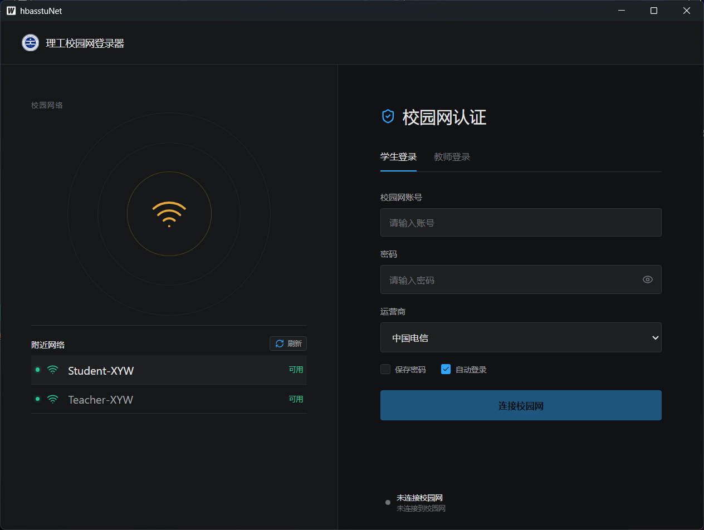

# 理工校园网登录器

面向湖北文理学院理工学院校园网的 Windows 桌面认证客户端，自动识别网络并完成 Portal 认证，告别浏览器登录。

   

> [!WARNING]
> 本项目仅用于学习、研究和个人合法网络接入。请遵守学校网络管理规定，不得用于绕过认证、共享账号、干扰网络或其他未授权行为。使用前请阅读[免责声明](./DISCLAIMER.md)。

<p align="center">
  
</p>

## ✨ 功能特性

- 识别 `Student-XYW`、`Teacher-XYW` 网络
- 支持学生/教师账号切换
- 支持联通、移动、电信运营商
- 自动完成 CSRF Token、Cookie、登录、登出流程
- 显示 SSID、IP、MAC、信号强度
- 支持保存密码和自动登录
- 开机自启动（托盘后台运行）
- 使用 Windows DPAPI 加密存储密码

> [!NOTE]
> 关闭窗口可选择最小化到系统托盘，后台会自动检查状态并重新登录。

## 📦 安装

### 方式一：下载 Release

从 [GitHub Releases](https://github.com/XtSilan/hbasstuNet/releases) 下载最新版本的 `.exe` 文件，双击运行即可。

### 方式二：自行构建

需要安装：
- [Go 1.25+](https://go.dev/dl/)
- [Node.js 20+](https://nodejs.org/)
- [Wails v2](https://wails.io/docs/gettingstarted/installation)

```powershell
git clone https://github.com/XtSilan/hbasstuNet.git
cd hbasstuNet
npm ci --prefix frontend
wails build -clean
```

生成的可执行文件位于 `build/bin/hbasstuNet.exe`。

## 🚀 使用方法

1. 启动程序，自动扫描附近校园 Wi-Fi
2. 选择学生或教师网络
3. 输入账号、密码和运营商
4. 勾选"保存密码"和"自动登录"
5. 点击"连接校园网"
6. 设置页可开启"开机自启动"

## 🧱 技术栈与架构

| 层级 | 技术 | 用途 |
| --- | --- | --- |
| 桌面容器 | Wails v2 | Windows 原生窗口与 Go/前端绑定 |
| 前端 | Vue 3 + TypeScript + Vite | 登录与网络状态界面 |
| 图标 | Lucide Vue Next | 一致的线性界面图标 |
| 核心 | Go | Portal 认证、网络检测、状态管理 |
| Windows 集成 | Registry + DPAPI | 开机启动与凭据保护 |

```text
hbasstuNet.exe
├── Wails UI
│   └── Vue 3 + TypeScript
└── Go Core
    ├── Windows Wi-Fi 检测
    ├── Portal HTTP 客户端
    ├── 设置与 DPAPI 凭据保护
    └── 开机启动管理
```

## 📁 目录结构

```text
.
├── app.go                    # Wails 应用服务与状态管理
├── main.go                   # 桌面程序入口
├── internal/config/          # 设置与 DPAPI 凭据保护
├── internal/network/         # Windows Wi-Fi 和接口识别
├── internal/portal/          # Portal API 客户端
├── internal/startup/         # Windows 开机启动项
├── frontend/src/             # Vue 3 界面
├── build/windows/            # 图标、清单和 NSIS 配置
└── .github/workflows/        # 自动测试与 Windows 构建
```

## 🗺️ 路线图

- [x] 系统托盘与窗口隐藏
- [x] Portal 状态检查与自动重连
- [ ] Windows 安装程序
- [ ] 多账号管理
- [ ] CLI 版本
- [ ] macOS 与 Linux 支持

## 📄 许可证

[MIT License](./LICENSE)

项目名称、校园网络名称及相关标识不代表学校官方背书；使用本软件还须遵守[免责声明](./DISCLAIMER.md)和所在网络的管理规定。